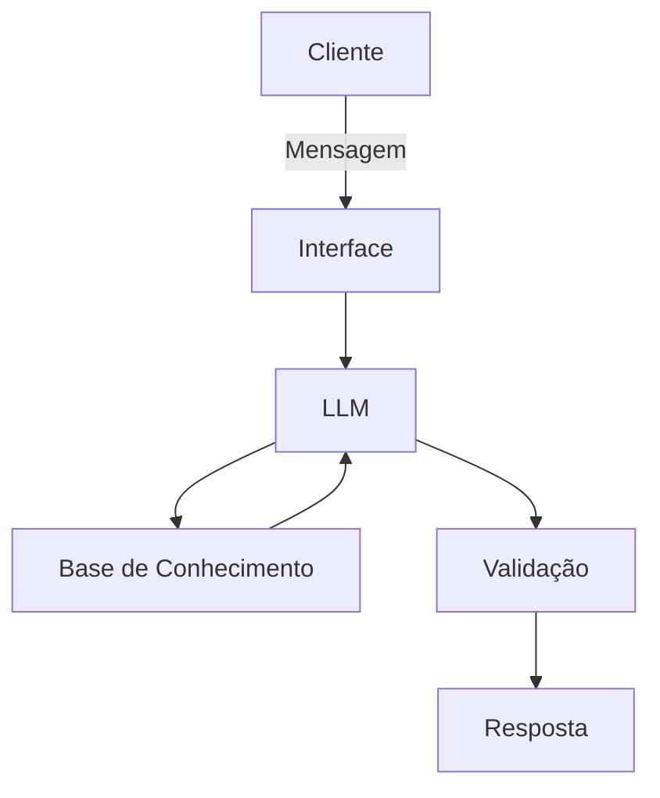

# Documentação do Agente

## Caso de Uso

### Problema
> Qual problema financeiro seu agente resolve?

Muitos jovens adultos entre 18 e 39 anos possuem dificuldade em organizar suas finanças pessoais. Eles não conseguem identificar para onde o dinheiro está indo, não possuem controle sobre seus gastos mensais e têm dificuldade em visualizar o impacto de suas decisões financeiras no longo prazo.
Além disso, a falta de ferramentas simples e acessíveis faz com que o controle financeiro seja negligenciado, resultando em desorganização e dificuldade em economizar.

### Solução
> Como o agente resolve esse problema de forma proativa?

O agente atua como um assistente financeiro pessoal que permite ao usuário registrar gastos por meio de linguagem natural, consultar resumos financeiros e simular cenários futuros de economia.

### Público-Alvo
> Quem vai usar esse agente?

- Pessoas em início ou crescimento de carreira
- Pessoas com dificuldade em controlar gastos
- Pessoas que desejam economizar, mas não possuem planejamento financeiro estruturado
- Usuários que buscam soluções simples, rápidas e acessíveis

---

## Persona e Tom de Voz

### Nome do Agente
HelpBot

### Personalidade
> Como o agente se comporta? (ex: consultivo, direto, educativo)

O agente possui um comportamento consultivo e educativo, auxiliando o usuário a entender melhor seus hábitos financeiros.

Ele se comporta de forma:

- Direta e objetiva
- Amigável e acessível
- Educativa, sem excesso de termos técnicos
- Proativa, oferecendo sugestões baseadas nos dados do usuário

### Tom de Comunicação
> Formal, informal, técnico, acessível?

O agente utiliza um tom de comunicação: Claro, levemente informal(sem perder a profissionalidade), objetivo(evitando respostas longas e complexas), motivador(incentivando boas práticas financeiras).

### Exemplos de Linguagem
- Saudação: "Olá! Posso te ajudar a organizar seus gastos ou simular sua economia?"
- Confirmação: "Entendi. Vou registrar esse gasto para você."
- Erro/Limitação: "Não tenho essa informação no momento, mas posso te ajudar com seus gastos e simulações financeiras."

---

## Arquitetura

### Diagrama

### Componentes

| Componente | Descrição |
|------------|-----------|
| Interface | [Chatbot em Streamlit] |
| LLM | [GPT-4 via API] |
| Base de Conhecimento | [JSON/CSV com dados do cliente de gastos, perfil e histórico] |
| Validação | [Regras para evitar alucinação e garantir consistência dos dados] |

---

## Segurança e Anti-Alucinação

### Estratégias Adotadas

- [ ]O agente responde apenas com base nos dados fornecidos
- [ ]Não inventa valores ou informações financeiras
- [ ]Quando não possui dados suficientes, informa claramente a limitação
- [ ]Não realiza recomendações financeiras fora do escopo definido

### Limitações Declaradas
> O que o agente NÃO faz?

Recomendações de investimentos personalizados, análises financeiras complexas ou consultoria especializada, integração com contas bancárias reais, previsões baseadas em dados externos não fornecidos, respostas fora do escopo de controle de gastos e simulação financeira.
